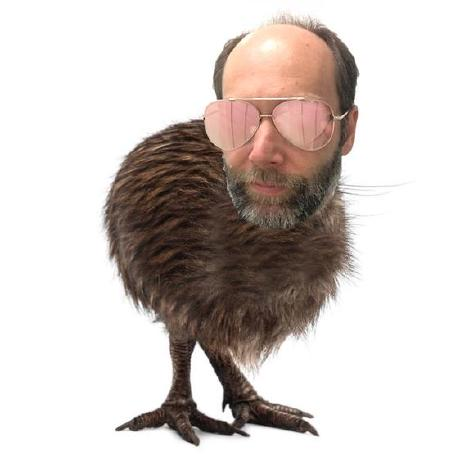
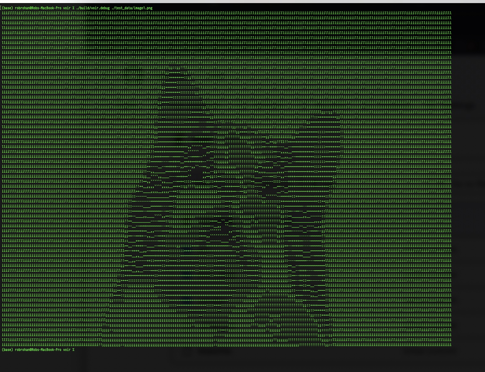

# Voir

A simple application to display images in a terminal. It is a utitlity I use when I am ssh'ed into a server and need a quick idea of what is in an image stored on the server. It tries to resize the image to fit in the current size of the terminal.

For example, in a normal sized terminal, it lets you view an image like this:



in the terminal like this:

```
iiiiiiiiiiiiiiiiiiiiiiiiiiiiiiiiiiiiiiiiiiiiiiiiiiiiiiiiiiiiiiiiiiiiiiii
iiiiiiiiiiiiiiiiiiiiiiiiiiiiiiiiiiiiiiiiiilllllllliiiiiiiiiiiiiiiiiiiiii
iiiiiiiiiiiiiiiiiiiiiiiiiiiiiiiiiiiillllllll!!!!::++lliiiiiiiiiiiiiiiiii
iiiiiiiiiiiiiiiiiiiiiiiiiiiiiiiiii!!;;lliiiill!!;;~~~~lliiiiiiiiiiiiiiii
iiiiiiiiiiiiiiiiiiiiiiiiiiiiiiiiii::!!llllll!!;;::++--++iiiiiiiiiiiiiiii
iiiiiiiiiiiiiiiiiiiiiiiiiiiiiiii!!::!!!!!!!!;;::::++----iiiiiiiiiiiiiiii
iiiiiiiiiiiiiiiiiiiiiiiiiiiiiiii!!::!!!!!!!!;;::++~~__--iiiiiiiiiiiiiiii
iiiiiiiiiiiiiiiiiiiiiiiiiiiiiiiill;;!!;;;;;;;;::++~~__~~iiiiiiiiiiiiiiii
iiiiiiiiiiiiiiiiiiiiiiiiiiiiiiiill!!;;::++++;;;;;;++--~~iiiiiiiiiiiiiiii
iiiiiiiiiiiiiiiiiiiiiiiiii!!;;++;;;;;;::::::!!;;;;++--~~iiiiiiiiiiiiiiii
iiiiiiiiiiiiiiiiiiiiii!!++__,,,,::;;::::;;++::;;::++--++iiiiiiiiiiiiiiii
iiiiiiiiiiiiiiiiiiii;;--__,,,,,,__::::::::~~~~++++~~--;;iiiiiiiiiiiiiiii
iiiiiiiiiiiiiiiiii!!--__,,,,,,,,,,~~++++~~--~~++~~--~~iiiiiiiiiiiiiiiiii
iiiiiiiiiiiiiiiiii++____,,,,,,,,,,__~~~~--__--~~--__++iiiiiiiiiiiiiiiiii
iiiiiiiiiiiiiiii!!--,,,,,,,,,,,,,,____------________::iiiiiiiiiiiiiiiiii
iiiiiiiiiiiiiiii::__,,,,,,,,,,,,,,______----__,,,,--::lliiiiiiiiiiiiiiii
iiiiiiiiiiiiiiii++__,,,,````````,,,,__------__,,,,--++lliiiiiiiiiiiiiiii
iiiiiiiiiiiiiiii++__,,````,,``,,,,,,,,________,,,,--~~!!iiiiiiiiiiiiiiii
iiiiiiiiiiiiiiii::____,,``````,,,,,,,,,,,,,,,,,,,,__--!!iiiiiiiiiiiiiiii
iiiiiiiiiiiiiiii;;--__``````````,,,,,,,,,,,,``,,,,,,--!!iiiiiiiiiiiiiiii
iiiiiiiiiiiiiiiill~~__,,,,````,,,,,,,,,,,,``,,,,,,,,--;;iiiiiiiiiiiiiiii
iiiiiiiiiiiiiiiiii++__,,````,,,,__,,,,,,,,,,,,__,,__::lliiiiiiiiiiiiiiii
iiiiiiiiiiiiiiiiii!!____,,,,,,,,__,,,,,,,,,,______~~!!iiiiiiiiiiiiiiiiii
iiiiiiiiiiiiiiiiiiii::--____,,,,,,,,,,,,,,________::iiiiiiiiiiiiiiiiiiii
iiiiiiiiiiiiiiiiiiiiii!!~~____,,,,,,,,,,,,,,____~~lliiiiiiiiiiiiiiiiiiii
iiiiiiiiiiiiiiiiiiiiiiii!!--__,,,,,,,,,,,,,,--++!!iiiiiiiiiiiiiiiiiiiiii
iiiiiiiiiiiiiiiiiiiiiiiiii~~____,,____--__--;;lliiiiiiiiiiiiiiiiiiiiiiii
iiiiiiiiiiiiiiiiiiiiiiiiii++,,;;____~~++++!!iiiiiiiiiiiiiiiiiiiiiiiiiiii
iiiiiiiiiiiiiiiiiiiiiiiiii::__ii++,,++!!lliiiiiiiiiiiiiiiiiiiiiiiiiiiiii
iiiiiiiiiiiiiiiiiiiiiiiiii::__iill____!!iiiiiiiiiiiiiiiiiiiiiiiiiiiiiiii
iiiiiiiiiiiiiiiiiiiiiiiiii~~__llii++``~~lliiiiiiiiiiiiiiiiiiiiiiiiiiiiii
iiiiiiiiiiiiiiiiiiiiiiii!!__,,;;ii::``,,~~;;lliiiiiiiiiiiiiiiiiiiiiiiiii
iiiiiiiiiiiiiiiiiiii;;~~__,,,,__;;!!--,,``,,--++lliiiiiiiiiiiiiiiiiiiiii
iiiiiiiiiiiiiiiiii!!++++::~~________--::::++~~--;;iiiiiiiiiiiiiiiiiiiiii
iiiiiiiiiiiiiiiiiiiiiiiiiiii::::lllllliiiiiiiiiiiiiiiiiiiiiiiiiiiiiiiiii
iiiiiiiiiiiiiiiiiiiiiiiiiiiiiiiiiiiiiiiiiiiiiiiiiiiiiiiiiiiiiiiiiiiiiiii
```

If you "zoom way out" in your terminal, you can get more detail in the image representation. For example:



## Release

```bash
make release_cli
```

```bash
./build/${PLATFORM}/voir ./test_data/image1.png
```

## Debug

```bash
make build
```

```bash
./build/${PLATFORM}/voir.debug ./test_data/image1.png
```
