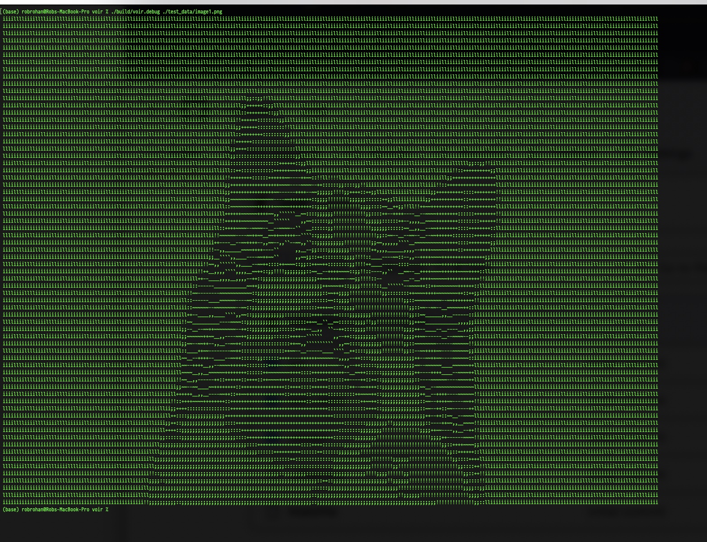
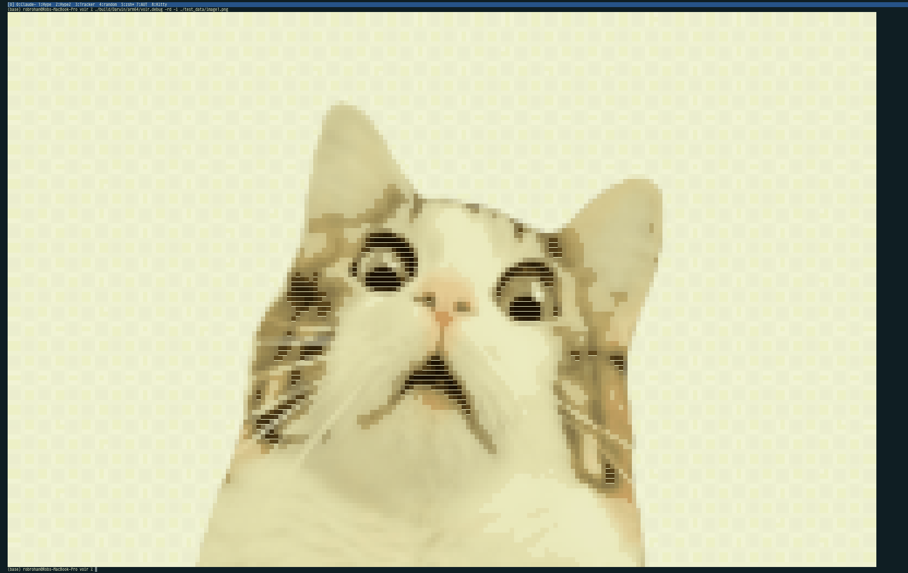
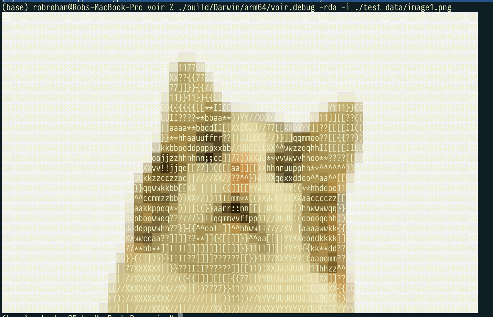
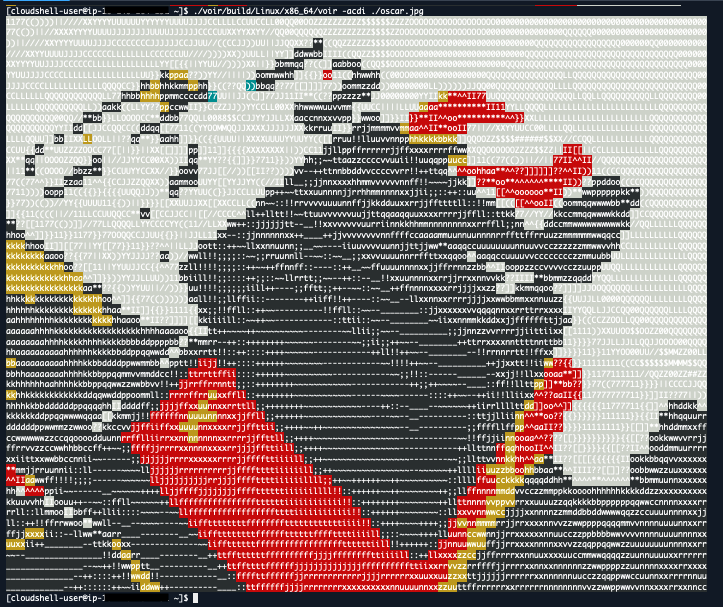

# Voir

[](https://github.com/robrohan/voir/actions/workflows/build.yml)

Voir is a simple application to display images in a terminal. It is a utility I use when I am ssh'ed into a server and need a quick idea of what is in an image stored on the server. It tries to resize the image to fit in the current size of the terminal.

Unlike similar utilities, voir is small, has no external dependencies, and standalone.

For example, in a normal sized terminal, it lets you view an image like this:







## Usage

See `voir -h` for up to date usage. As of this writing:

```bash
voir: basic image viewer for the terminal
Basic usage:
         voir -i &lt;image&gt;
Options:
         -a - only use ascii chars (default utf8)
         -d - use dark mode
         -c - use colors (nearest ANSI 16-color)
         -r - use true RGB colors (requires 24-bit terminal support)
         -x - number of column (for output)
         -y - number of rows (for output)
         -h - help screen; this
```

## Building on AWS Cloudshell

```bash
sudo yum groupinstall "Development Tools" -y
git clone https://github.com/robrohan/voir.git
cd voir
make release_cli
./build/Linux/x86_64/voir -i &lt;image_file&gt;
```



## Building

### Release

```bash
make release_cli
```

```bash
./build/${PLATFORM}/${CPU}/voir -i ./test_data/image1.png
```

### Debug

```bash
make build
```

```bash
./build/${PLATFORM}/${CPU}/voir.debug -i ./test_data/image1.png
```
